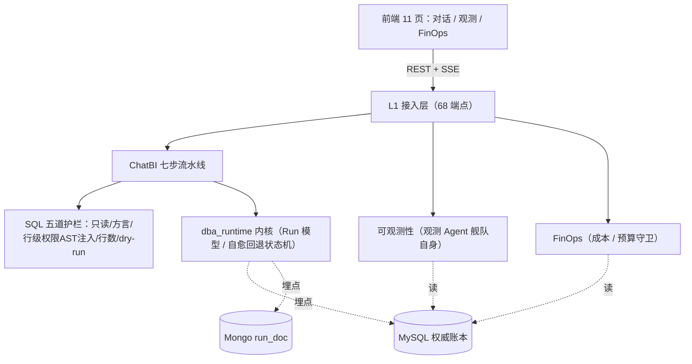

# dba-platform

数据大屏 × 多 Agent 平台（三模块：ChatBI / Observability / FinOps）。

本仓库是 **uv workspace** 单体仓库：

```
packages/agent-runtime   # 可复用运行时内核（L2，零外部依赖）
apps/platform            # 平台单体应用（FastAPI + 三模块）
apps/worker              # 常驻定时任务
deploy/                  # docker-compose / Dockerfile
migrations/              # Alembic
```

## 快速开始

> ★ 外部组件（MySQL / MongoDB / Redis / Milvus / Elasticsearch / MinIO / Embedding）
> 已迁到**虚拟机 192.168.200.10**，本机不再用 `docker-compose` 拉起。首次使用请在
> 虚拟机上执行 `bash deploy/vm-provision.sh` 准备好 MySQL/Redis/Embedding，详见
> `deploy/VM_SETUP.md`。

```bash
uv sync --all-packages --extra prod          # 安装（含全量存储驱动）
cp .env.example .env                          # 按需覆盖（默认已指向 192.168.200.10）
uv run dba migrate                            # Alembic 升级 MySQL
uv run dba bootstrap-storage                  # 建 Milvus/ES/MinIO 资源
uv run dba seed --demo                        # 灌入口径/技能/价格表/演示数据
uv run uvicorn dba.main:app --reload --port 8000
```

> `deploy/docker-compose.yml` 已改为**参考 / 备用**（本地全栈回滚用），默认不启用。

## 架构



**核心设计**：一个 `trace_id`（Run）贯穿一次提问——ChatBI 看它是执行记录、可观测性看它是观测对象、
FinOps 看它是计量对象，**埋点只做一次**，三模块是同一份运行时数据的三个视角。

## 截图

| 对话 + 驾驶舱 | 排行 + 堆叠 + 趋势 |
|---|---|
|  |  |

## 评测

```bash
export DBA_TEST_MYSQL_DSN=<你的 MySQL DSN>   # golden 需真实 MySQL（会建 eval 表）
uv run dba eval --suite all --gate evals/thresholds.yaml
```

| 指标 | 值 | 门槛 |
|---|---|---|
| Execution Accuracy（overall） | **0.906** | ≥ 0.80 |
| 行级权限对抗集（guard） | **121 / 121** | = 1.00 |
| 权限边界题 EX（permission_boundary） | **1.000** | = 1.00 |

> 口径：`golden` 用**录播候选 SQL**，衡量的是「护栏注入 + 执行 + 比较」链路的正确性，**不是模型准确率**
> （见 `evals/README.md`）。`guard` 套件离线可跑、不写库。

## 质量

```bash
uv run ruff check .
uv run mypy packages apps
uv run pytest -q
```

> 当前进度：**B0~B6 均已交付** —— 存储适配层 / L4 能力层 / 三模块业务（ChatBI · 可观测性 · FinOps）/
> 聊天主链路与大屏前端 / 评测套件。后端 **68 个 API 端点**；前端 **11 个页面**（登录 + 对话 +
> 观测 5 页 + FinOps 4 页）。
>
> **默认走确定性演示替身**（`DemoLLMClient`）——追问同一问题结果稳定；要让大屏真正随问题变化，
> 见下方「接真实模型」。

## 接真实模型（让大屏随问题变化）

```bash
# .env
DBA_ENV=dev
DBA_LLM_PROVIDER=deepseek
DBA_LLM_BASE_URL=https://api.deepseek.com/v1   # ★ 只到 /v1，SDK 会自行追加 /chat/completions
DBA_LLM_API_KEY=sk-xxx
DBA_LLM_ALLOW_DEV=true                          # ★ dev 默认走替身，置 true 才用真实模型
DBA_LLM_MODEL_PREMIUM=deepseek-chat
DBA_LLM_MODEL_STANDARD=deepseek-chat
DBA_LLM_MODEL_ECONOMY=deepseek-chat
```

**LLM 三态开关**（优先级由高到低）：

1. `DBA_LLM_USE_FAKE=true` → 恒用替身（**浏览器 e2e 靠它锁死确定性**）
2. `DBA_ENV=test` 或 API Key 为空 → 替身
3. `DBA_ENV=dev` 且未设 `DBA_LLM_ALLOW_DEV=true` → 替身（避免开发期误打付费 API）
4. 否则 → 真实模型

> ⚠️ 前置：真实模型依赖**语义层**才知道表结构。请确保已跑 `uv run dba seed --demo`
> （它会登记 `sem_metric` 口径与 15 条 `sem_field_mapping` 字段映射）。
