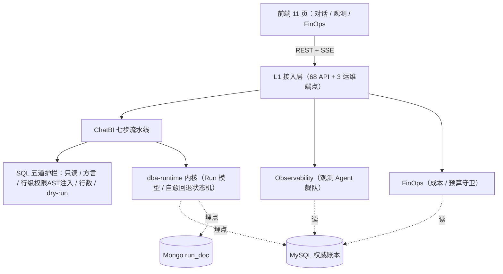
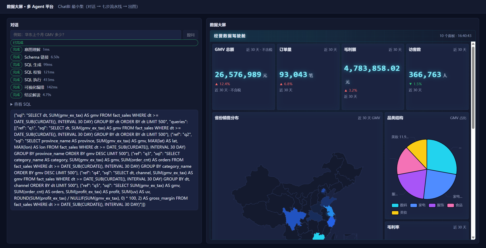
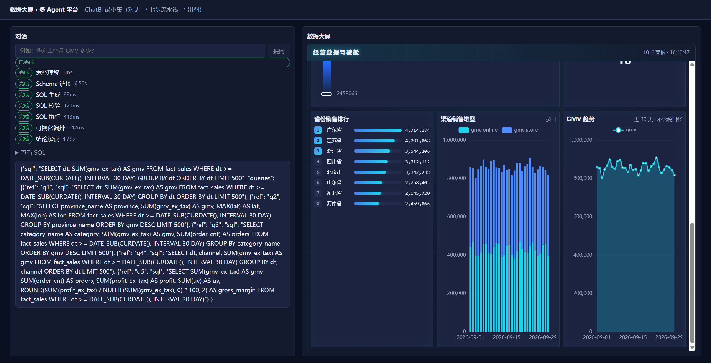

# dba-platform

**数据大屏 × 多 Agent 平台**：用自然语言生成数据大屏，并对「生成过程本身」做治理。

一个 **uv workspace** 单体仓库，围绕同一个运行时内核构建三大模块：

| 模块 | 一句话职责 |
|---|---|
| **ChatBI** | 「问一句 → 出一屏」：七步流水线 + 五道 SQL 护栏 |
| **Observability** | 观测 Agent 舰队自身：指标 / 拓扑 / 异常 / 静默失败 |
| **FinOps** | 成本计量、预算守卫、复用率优化 |

---

## 核心设计

1. **一个 `trace_id` 三视角**：一次提问（Run）贯穿全程——ChatBI 看它是执行记录、Observability 看它是观测对象、FinOps 看它是计量对象。**埋点只做一次**，三模块是同一份运行时数据的三个视角。
2. **行级权限生成期下沉**：权限在 SQL **生成阶段**就注入 `WHERE` 条件，不做「查完再过滤」——否则敏感数据已进过内存 / 日志 / LLM 上下文。护栏用 AST（sqlglot）+ 合取项覆盖性断言，fail-closed。
3. **预算守卫前置**：LLM 调用**前** `reserve → settle/release` 三段式，软限降级、硬限熔断，且**硬熔断默认关闭**（唯一会中断业务的动作，避免误配全熔断）。

---

## 项目目录结构

```
packages/agent-runtime    # 可复用运行时内核（L2）：Pipeline / RunContext / 埋点 / Protocol
apps/platform             # 平台单体应用（FastAPI + 三模块 + L4 能力 + L5 存储）
  └─ src/dba/
      ├─ api/             #   L1 接入层：路由 / 中间件 / 依赖注入（68 个 API）
      ├─ modules/         #   L3 领域层：chatbi / observability / finops
      ├─ capabilities/    #   L4 能力层：budget / cost / embedding / memory / messaging / routing / semantics / skills / telemetry
      └─ storage/         #   L5 存储层：es / milvus / minio / mongo / mysql / redis + protocols.py 契约
apps/worker               # 常驻定时任务（rollup / 异常扫描 / 对账 / 分区 / 归档）
frontend/                 # React 18 + Vite 7 前端（11 页）
migrations/               # Alembic（0001 建表 / 0002 outbox / 0003 性能索引）
deploy/                   # Dockerfile + embedding_server.py（本地 bge-m3 向量服务）
scripts/                  # 造数 / 连通性自检 / 一次性运维脚本
docs/                     # 竞品对比 / 演示脚本 / 命名约定 / 代码优化说明 / 联调验证报告
evals/                    # 评测框架 + golden 题集（32 题）+ CI 门槛
tests/                    # e2e + QA 黑盒/契约/DoD 测试
assets/                   # README 截图
var/                      # 运行时数据目录（DLQ 等，不入库）
```

---

## 技术栈

| 层 | 选型 |
|---|---|
| 后端 | FastAPI · SQLAlchemy(asyncio) + asyncmy · motor · redis · pymilvus · elasticsearch · minio · openai/anthropic |
| 前端 | React 18 · Vite 7 · TypeScript · ECharts（按需注册）· TanStack Query · Zustand |
| 工具链 | uv（workspace）· ruff（line-length=100）· mypy（strict）· pytest（asyncio_mode=auto）· Python ≥ 3.12 |

---

## 快速开始

> ★ 外部组件（MySQL / MongoDB / Redis / Milvus / Elasticsearch / MinIO / Embedding）
> 已部署在**虚拟机 `192.168.200.10`**，本机不拉容器。连接凭据见 `.env`（默认已指向该地址）。

```bash
uv sync --all-packages --extra prod          # 安装（含全量存储驱动）
cp .env.example .env                          # 按需覆盖
uv run dba migrate                            # Alembic 升级 MySQL
uv run dba bootstrap-storage                  # 建 Milvus / ES / MinIO 资源
uv run dba seed --demo                        # 灌入口径 / 技能 / 价格表 / 演示数据
uv run uvicorn dba.main:app --reload --port 8000
```

前端：

```bash
cd frontend && npm install && npm run dev     # Vite dev server（默认 5173）
```

常用登录账号（demo）：`admin / admin123`、`analyst1 / analyst123`。

---

## 架构



分层边界（**红线 1** 用 ruff `banned-api` 静态强制，L3 模块之间禁止互相 import）：

| 层 | 目录 | 职责 |
|---|---|---|
| L1 接入 | `api/` | FastAPI 路由 + 中间件 + 依赖注入 |
| L2 内核 | `packages/agent-runtime` | Pipeline / RunContext / 埋点 / Protocol |
| L3 领域 | `modules/{chatbi,observability,finops}` | 三模块业务 |
| L4 能力 | `capabilities/` | budget / cost / embedding / memory / skills / telemetry … |
| L5 存储 | `storage/` | es / milvus / minio / mongo / mysql / redis + `protocols.py` 契约 |

### ChatBI 七步流水线

`intent` → `schema_link` → `sql_gen` → `sql_guard` → `sql_exec` → `visual` → `narrator`，
失败时 `sql_gen` 可自愈重生成（带重试上限）。五道护栏全部 **fail-closed**。

---

## 命令行（`dba`）

```bash
dba migrate            # Alembic 升级 MySQL（幂等）
dba bootstrap-storage  # 建 Milvus collection / ES index / MinIO bucket
dba seed               # 灌入口径 / 技能模板 / 价格表 / 演示数据（--demo）
dba reindex            # 重建检索索引（Milvus / ES）
dba eval               # 运行评测套件（--suite guard|golden|all --gate evals/thresholds.yaml）
```

---

## 截图

| 对话 + 驾驶舱 | 排行 + 堆叠 + 趋势 |
|---|---|
|  |  |

---

## 质量

```bash
uv run ruff check .          # 静态检查（含分层红线）
uv run mypy packages apps    # 严格类型检查
uv run pytest -q             # 基线：165 passed / 29 skipped
```

| 检查项 | 基线结果 |
|---|---|
| ruff | All checks passed |
| mypy（strict） | no issues in 166 source files |
| pytest | 165 passed / 29 skipped（共 194 用例被收集） |

> 测试分层：`packages/*/tests` 单元 · `apps/*/tests` 应用集成 · `tests/e2e` 端到端 ·
> `tests/qa` QA 独立黑盒/契约/DoD 复验（不依赖工程师用例，自行构造断言）。

---

## 评测

```bash
export DBA_TEST_MYSQL_DSN=<你的 MySQL DSN>   # golden 需真实 MySQL（会建 eval 表）
uv run dba eval --suite all --gate evals/thresholds.yaml
```

| 指标 | 值 | 门槛 |
|---|---|---|
| Execution Accuracy（overall） | **0.906** | ≥ 0.80 |
| 行级权限对抗集（guard） | **121 / 121** | = 1.00 |
| 权限边界题（permission_boundary） | **1.000** | = 1.00 |

> 口径：golden **32 题**（单表 8 / 多表 JOIN 8 / 时间对比 8 / 权限边界 8），用**录播候选 SQL**，
> 衡量的是「护栏注入 + 执行 + 比较」链路的正确性，**不是模型准确率**（见 `evals/README.md`）。
> `guard` 套件离线可跑、不写库。退出码即结论：`0` 达标 · `1` 未达标 · `2` 执行错误。

---

## 默认行为与接真实模型

**开箱即用**：默认走确定性演示替身（`DemoLLMClient`）——追问同一问题结果稳定。

要让大屏真正随问题变化，配置真实模型：

```bash
# .env
DBA_ENV=dev
DBA_LLM_PROVIDER=deepseek
DBA_LLM_BASE_URL=https://api.deepseek.com/v1   # ★ 只到 /v1，SDK 会自行追加 /chat/completions
DBA_LLM_API_KEY=sk-xxx
DBA_LLM_ALLOW_DEV=true                          # ★ dev 默认走替身，置 true 才用真实模型
DBA_LLM_MODEL_PREMIUM=deepseek-chat
DBA_LLM_MODEL_STANDARD=deepseek-chat
DBA_LLM_MODEL_ECONOMY=deepseek-chat
```

**LLM 三态开关**（优先级由高到低）：

1. `DBA_LLM_USE_FAKE=true` → 恒用替身（**浏览器 e2e 靠它锁死确定性**）
2. `DBA_ENV=test` 或 API Key 为空 → 替身
3. `DBA_ENV=dev` 且未设 `DBA_LLM_ALLOW_DEV=true` → 替身（避免开发期误打付费 API）
4. 否则 → 真实模型

> ⚠️ 前置：真实模型依赖**语义层**才知道表结构。请确保已跑 `uv run dba seed --demo`
> （它会登记 `sem_metric` 口径与 15 条 `sem_field_mapping` 字段映射）。

---

## 运维脚本（`scripts/`）

| 脚本 | 用途 |
|---|---|
| `bootstrap.sh` | 一键引导（建资源 / 迁移 / 造数） |
| `seed.py` | 造数：口径 / 价格表 / 技能 / 预算 / 演示数据 |
| `check_vm_components.py` | VM 外部组件连通性自检（MySQL/Mongo/Redis/Milvus/ES/MinIO/Embedding） |
| `check_milvus_collections.py` | Milvus collection 自检 |
| `replay_span_dlq.py` | 把 `var/dlq/telemetry.jsonl` 里的 span 重投回 Mongo `run_doc`（`--dry-run` 可预览） |
| `backfill_run_summary.py` | 一次性回填历史 `run` 的 tokens / cost 汇总字段 |
| `run_anomaly_scan_once.py` | 手动触发一次异常扫描 + 滞留 Run 收口 |

---

## 已知问题（联调验证）

`docs/联调验证报告.md` 记录了真实浏览器 + 全量 API + SSE + 存储层核对的完整结论。当前**待修复的阻断项**：

| 优先级 | 问题 | 位置 |
|---|---|---|
| 🔴 P0 | 真实 LLM 提问重试不收敛（`_build_retry_messages` 丢弃表清单）；前端步骤徽标与「提问」按钮永久卡死 | `modules/chatbi/agents/sql_gen.py` · 前端 `features/chat/store/runStore.ts` |
| 🔴 P0 | 观测总览页 KPI 对象未取 `.value` → React 崩溃，且无 Error Boundary 导致整站失效 | `frontend/src/pages/observability/OverviewPage.tsx` · `components/PageBits.tsx` |
| 🟠 P1 | Run 详情接口取数入口写错（`metering.get_run_doc` 不存在），异常被静默吞掉 | `api/v1/observability.py` · `storage/mongo/repo.py` |
| 🟠 P1 | 护栏报错函数名失真（sqlglot 规范化名） | `modules/chatbi/guard` |

---

## 文档索引

- [竞品对比与差异化](docs/competitors.md)
- [40 分钟演示脚本](docs/demo-script.md)
- [命名与代码组织约定](docs/conventions.md)
- [代码优化说明](docs/代码优化说明.md)
- [联调验证报告](docs/联调验证报告.md)
- [评测框架说明](evals/README.md)

---

## License

[MIT](LICENSE)
