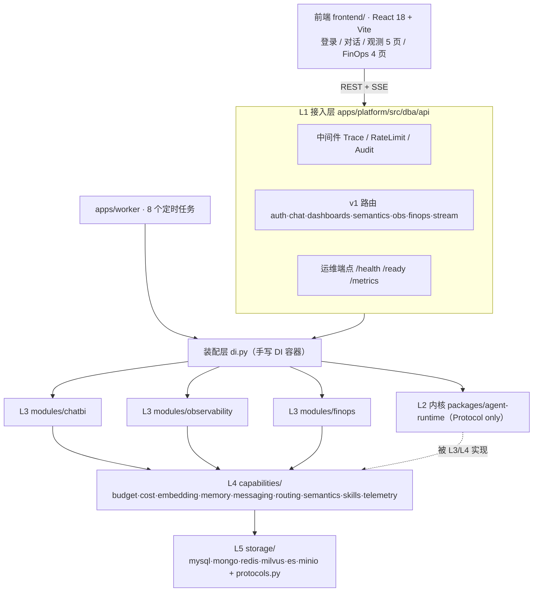
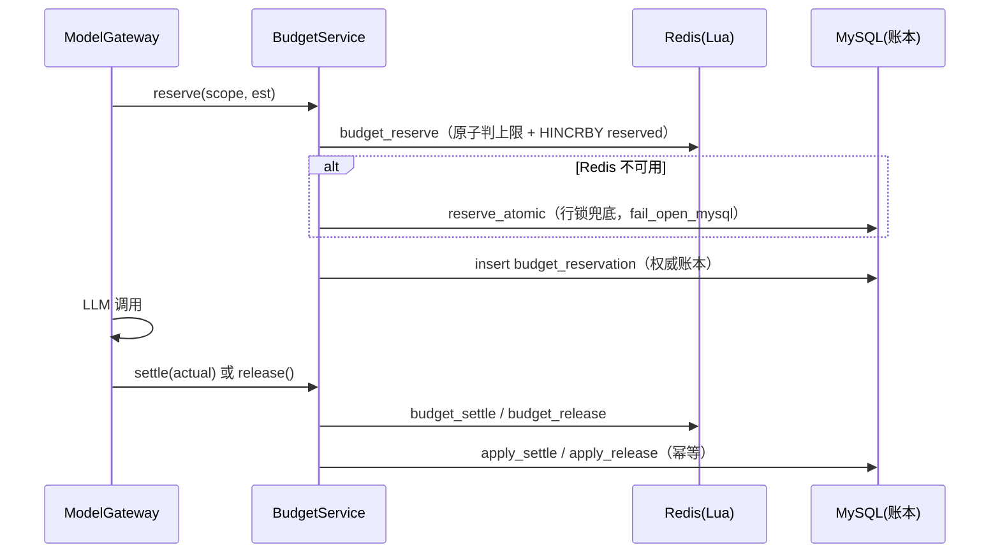

# 代码设计文档 · dba-platform

> **文档性质**：反向推导文档，以当前工作区**实际代码**为唯一事实来源。
> **读者**：后端/前端工程师、架构评审、运维
> **配套文档**：[PRD](./PRD.md) · [需求文档](./requirements.md)

---

## 1. 架构总览

### 1.1 分层



### 1.2 目录与职责

| 层 | 目录 | 职责 |
|---|---|---|
| L1 接入 | `apps/platform/src/dba/api/` | FastAPI 路由、中间件、依赖注入、统一错误体 |
| L2 内核 | `packages/agent-runtime/` | `RunContext` / `Pipeline` / 埋点装饰器 / Protocol 契约（故意只依赖 pydantic + opentelemetry-api + 标准库） |
| L3 领域 | `apps/platform/src/dba/modules/` | `chatbi` / `observability` / `finops` 三个业务模块 |
| L4 能力 | `apps/platform/src/dba/capabilities/` | budget / cost / embedding / memory / messaging / routing / semantics / skills / telemetry |
| L5 存储 | `apps/platform/src/dba/storage/` | mysql / mongo / redis / milvus / es / minio 适配 + `protocols.py` 契约 |
| 前端 | `frontend/` | React 18 + Vite + TypeScript + ECharts + TanStack Query + Zustand |
| 常驻任务 | `apps/worker/` | APScheduler 驱动的 8 个周期任务 |

### 1.3 装配与降级

应用由 `create_app()` 装配，生命周期（`lifespan`）内必须完成三件事，缺一即成为「最难发现的故障」：

1. `bind_metering(metering, cost=...)`——未绑定则埋点静默 no-op，因此绑定失败**直接拒绝启动**；
2. 启动 `drain_queue` 投递协程与 outbox 投递器 `run_forever()`；
3. 用 `RunContext(module="system")` 包裹启动上下文并 `set_current`。

`di.py` 的分层装配遵循「**可选驱动缺失只降级、不终止启动**」：6 个存储组件各自独立 try，失败即记 `available[name]=False` 并写 warning，占位实现一律显式命名 `*Placeholder`，绝不冒充真实实现。

中间件装配顺序为 `Audit → RateLimit → Trace`（后 add 的在外层），保证 `trace_id` 覆盖全部处理；`TraceMiddleware` 是 `run.started` 事件的唯一生产者，且对探针路径跳过（`/health` `/ready` `/metrics` `/openapi.json` `/docs` `/redoc`）。

---

## 2. 归属矩阵与协作规则

### 2.1 数据归属

**MySQL 21 张表**

| 分组 | 表 | owner |
|---|---|---|
| 组织与权限（5） | `biz_line` `auth_user` `auth_role` `auth_user_role` `row_scope_rule` | `capabilities.semantics`（权限子域） |
| 语义层（3） | `sem_metric` `sem_field_mapping` `sem_dict_entry` | `capabilities.semantics` |
| Run 埋点与成本（5） | `app_agent` `run` `llm_call` `tool_call` `price_book` | `capabilities.telemetry` / `capabilities.cost` |
| 预算（3） | `budget` `budget_usage` `budget_reservation` | `capabilities.budget` |
| 技能与聚合（5） | `skill_registry` `skill_usage` `metric_daily` `alert_event` `sql_audit` | `capabilities.skills` / `modules.observability` / `modules.chatbi` |

**MongoDB 8 个集合**：`chat_session` `chat_message` `dashboard_spec`（chatbi）· `run_doc`（telemetry）· `skill_def`（skills）· `anomaly_report`（observability）· `finops_recommendation`（finops）· `semantic_cache_entry`（memory）。

**Milvus 5 个 collection**：`dba_sem_metric_vec`（semantics）· `dba_skill_vec`（skills）· `dba_semantic_cache_vec`（memory，检索必须叠加 `ttl_epoch > now`）· `dba_finops_kb_vec`（finops）· `dba_obs_anomaly_vec`（observability）。**只允许经 owner 的检索方法访问，禁止模块直接 `client.search`。**

**Elasticsearch 3 个索引**（前缀 `dba`）：`dba-run-event`（保留 180d）· `dba-sql-audit`（365d）· `dba-metric-raw`（90d），ILM 策略 `dba-retention`。索引 `dynamic: strict`，写入不匹配会失败并落 DLQ。

**MinIO 5 个 bucket**：`dba-dashboard` · `dba-export` · `dba-skill-assets` · `dba-doc-chunks` · `dba-dlq`。

**Redis key 约定**：`run:progress:{trace_id}`（LIST，LTRIM 200，TTL 1h）、预算预留快照（TTL 3600s）、`job:lock:{id}`（SET NX EX，600s）、`rl:{client}`（限流）、`idem:{key}`（幂等）。

### 2.2 协作红线

1. **L3 模块之间禁止互相 import**——跨模块协作只能经 L4 能力层或 `trace_id` 软关联。典型体现：FinOps 的成本时序**必须**经 `ObservabilityService.timeseries` 读，不直连 `metric_daily`。
2. **L1 装配层例外**：`di.py` 与 `api/**` 需要静态 import 各模块，这是分层应有之义。
3. 每个 Repository Protocol 都带 `owner` ClassVar，`PROTOCOL_OWNERS` 可在运行期枚举校验。

> ⚠️ 红线 1 原先由 ruff `banned-api` 静态强制；当前构建配置已移除 ruff/mypy，该约束退化为**约定 + 评审**（见 §13）。

---

## 3. 运行时内核（L2）

内核的边界是「**不知道存储在哪儿**」：只依赖 pydantic + opentelemetry-api + 标准库，因此内核可以用 fake 实现完整跑通，不需要任何外部组件。

| 构件 | 关键设计 |
|---|---|
| `RunContext` | 不可变（含嵌套可变对象也冻结）；`trace_id` / `span_id` / `module` / `quality`（`eco`/`std`/`max`）；`set_current` / `reset_current` / `ctx()` 基于 ContextVar |
| `Pipeline` | `{step_name: Step}` 表 + 入口名；支持**原地重试**、**`goto` 带反馈回退**、**越权短路**；`_classify(exc)` 把异常映射为「是否可回退」 |
| `Step` | `name` / `agent` / `on_error`（`retry` / `fail`）/ `max_retries` / `goto_step` / `timeout_s` |
| `@traced` | 生成 child span 并**同时** `set_current(child)`，`finally` 里 `reset_current`——这是 span 树成立的前提 |
| `@metered` | LLM / tool / search 调用自动落 `LLMCallRecord` / `ToolCallRecord`，经队列异步投递 |
| 事件协议 | `EventEnvelope{event, seq, trace_id, ts, data}`；内核定义 **20 个** `EventType`（含 `heartbeat`），`EVENT_TYPE_COUNT = 20` |
| Protocol | `Agent` / `Tool` / `ModelRouter`（含 `stream`）/ `BudgetGuard` / `MemoryClient` / `SkillService` / `MeteringService` / `CostNormalizerProto` |
| 异常体系 | `DbaError` 同时携带**数值码** `code` 与**符号码** `symbol`，`classify()` 统一归一 |

**LLM 适配**：`LLMClient` Protocol 只依赖 OpenAI 兼容协议；`OpenAIClient` / `AnthropicClient` 在**方法内部**惰性导入第三方 SDK，因此 `import dba_runtime` 在任何环境都成立。

---

## 4. ChatBI 设计（模块 01）

### 4.1 七步流水线

| 步骤 | Agent | 职责要点 |
|---|---|---|
| ① `intent` | `IntentAgent` | 意图解析（查询/对比/归因/预测）+ 实体与时间范围抽取；默认走确定性规则（零 token） |
| ② `schema_link` | `SchemaLinkAgent` | 语义映射 + **行级权限第一道防线**：读 `row_scope_rule` 编译 `scope`，把「可访问表 + 权限值域」写进 system prompt |
| ③ `sql_gen` | `SqlGeneratorAgent` | 生成 SQL；支持携带失败 SQL 与校验反馈的**带约束重生成**；支持多查询信封（`{sql, queries[]}`） |
| ④ `sql_guard` | `SqlGuardAgent` | 调用护栏链；失败抛内核 `SqlGuardError` 由 Pipeline 回退；通过且此前失败时发 `sql.retry.resolved` |
| ⑤ `sql_exec` | `SqlExecAgent` | 唯一执行入口取数；超时/行数/权限三重约束同时生效 |
| ⑥ `visual` | `VisualAgent` | 可视化编排：技能确定性路径 / LLM 路径；逐面板下发 `dashboard.spec.delta` |
| ⑦ `narrator` | `NarratorAgent` | 结论解读（`router.stream` 流式）+ **显式报口径**；结果被截断必须说明 |

### 4.2 五道护栏

| 顺序 | 护栏 | 关键行为 |
|---|---|---|
| ① | `ReadonlyGuard` | `sqlglot.parse()` 要求**恰好一条语句**；只读类型判定；危险构造黑名单（`INTO OUTFILE/DUMPFILE`、`FOR UPDATE`、`LOCK IN SHARE MODE`、`@a := ...`、`/*! */`）；表与函数**白名单** |
| ② | `DialectGuard` | 目标方言往返校验，只负责「方言能否表达」 |
| ③ | `RowScopeInjector` | **权威防线**：AST 按每个 SELECT 自身作用域注入 `IN` 谓词；支持 `JoinPath` 跨表映射 |
| ③' | `RowScopeVerifier` | 兜底断言：顶层 AND 链必须含该合取项（`SQL_SCOPE_NOT_INJECTED`） |
| ④ | `LimitGuard` | LIMIT 归一 + `/*+ MAX_EXECUTION_TIME(ms) */` 提示 + 应用侧 `asyncio.timeout` |
| ⑤ | `DryRunGuard` | 只读账号 `EXPLAIN` 预执行，只覆盖元数据类错误 |

**语义澄清**：`SQL_PERMISSION_DENIED` 表示「连接账号 / 对象权限配置错误」，**不是**数据库层行级兜底；共享只读账号自身不带 per-user 行级隔离。规则值域为空必须拒绝（`SQL_SCOPE_EMPTY`），不得退化为放行整表。

### 4.3 唯一执行入口

`QueryExecutor.execute` 是全平台**唯一**允许执行真实 SQL 的入口，约束写在入口内部，任何调用方都绕不过去：连接来自只读池、超时、行数上限、审计写入。护栏共享一套 AST 工具（`guard/ast_utils.py`）作为**物理表名/别名映射的单一来源**，避免「① 判定允许的表、③ 判定的却是另一张表」这类安全不对称。

### 4.4 大屏组装

`DashboardSpecBuilder` 两条路径：`from_skill`（技能模板，确定性、省 token）与 `from_llm_json`（解析并校验 LLM 返回的 JSON 布局）。超过内联阈值（默认 500 行）的结果走对象存储并只下发预签名 URL。

---

## 5. Observability 设计（模块 03）

### 5.1 四角色流水线

`collect → aggregate → anomaly → broadcast`，**线性批处理**：每步失败原地重试 1 次后继续（`on_error="retry"`），因为观测是旁路——任何一步失败都不该让整批扫描无产出。

### 5.2 无阈值异常检测

```text
base_t   = α·value_t + (1-α)·base_{t-1}          # α = 0.3
MAD      = median(|x_i - median(x)|)
robust_z = 0.6745 · (latest - base) / MAD
判定      |robust_z| > k                          # k = 3.5
```

用 MAD 而非标准差，是为了避免「异常越大越检测不出来」；基线与 MAD **只用历史窗口**，不含待检点。严重度由 `|robust_z|` 分级。检测器内部 `exclude_modules=("observability","finops")`，不把自己的成本算进业务。

### 5.3 静默失败检测

`SilentFailureDetector` 在无报错但无产出的场景产出 `silent_failure` 类异常（同时覆盖低于 P5 的分位判定）。

### 5.4 指标 rollup

按 `(stat_date, biz_line_id, agent_uid, model)` **全量重算 + 主键 upsert**，重跑不翻倍；`avg_latency_ms` 按 `Σlatency / Σruns` 加权（不能对小时均值再平均）；`p50/p95` 不能由聚合再聚合，须从 ES 明细计算。`biz_line_id` 哨兵为 **0**（不是 -1），与 Milvus 分区键保持一致。

### 5.5 拓扑与 OTLP

- **拓扑**：由 `run_doc.spans[]` 的 `span_id` / `parent_span_id` / `name` / `kind` 聚合出 Agent→工具/子 Agent 图。`run_doc` 的 owner 是 L4 telemetry，因此本模块经 owner 接口读取。
- **OTLP 接入**：`POST /obs/otel/v1/traces` 支持 JSON 与 protobuf；外部 Agent 的 `usage_source=self_reported`，与内部 Run 用同一套结构呈现。

### 5.6 事件双写

每条异常同时写 MySQL `alert_event`（可检索事件行，`attribution_json` 只存展示摘要）与 Mongo `anomaly_report`（完整归因的权威源，含 hypothesis）。

---

## 6. FinOps 设计（模块 10）

### 6.1 四角色流水线

`meter → attribute → guard → optimize`。

### 6.2 成本作为派生量

明细（`llm_call` / `tool_call`）固化的核心事实是 **token 数与 `price_book_id`**；金额由 `CostNormalizer` 派生。收益：价格表修正后可**精确重算历史成本**，而不是打补丁。计价时输入 token 用 `prompt_tokens - cached_tokens`（`prompt_tokens` 是总输入）。价格缺失返回 `unknown`，不静默按 0 计。

### 6.3 预算守卫三段式



- 状态机：`RESERVED → SETTLED | RELEASED | EXPIRED`；非法迁移不改数。
- 决策：`allow` / `soft` / `hard`；软限动作 `ALERT | DOWNGRADE_MODEL | COMPRESS_CONTEXT | RATE_LIMIT`，硬限动作 `BLOCK | CIRCUIT_BREAK`。
- `self_reported` 用量不计入预算。
- 默认保守：`allow_circuit_break=False`（硬熔断关闭）、`exemption_priority=50` 豁免线、`kill_switch` 全局逃生。

### 6.4 护栏与死循环

`GuardrailPolicy` 由 `Settings.guardrail_policy()` 构造，覆盖降级/压缩/限流/熔断开关、熔断窗口（60s × 连续 3 个窗口）与冷却（300s）、单 Run 最大降级次数（2）。

死循环判据：`key = loop:{agent_uid}:{tool_name}:{sha256(canonical_json(args))}`，`count = incr_with_ttl(key, 300s)`，`count ≥ 8` 判定并告警。

### 6.5 复用率-成本曲线

必须带**对照组**：`hit`（命中技能的同类任务平均 token）与 `miss`（未命中），并给出相关系数；只画「复用率上升 + 成本下降」会被质疑是「业务本身变简单了」。

---

## 7. 数据模型

### 7.1 通用约定

- 时间：库内统一 UTC naive `DATETIME(3)`；时间窗半开 `[start, end)`，避免整点边界重复计入。
- 金额：`micro_usd` 整数（`1 USD = 1_000_000`），只做整数求和。
- 反范式：`run` / `llm_call` / `tool_call` 之间**只留 `trace_id` 软关联、不建外键**（高写入路径建外键会拖慢吞吐并妨碍分区裁剪）。

### 7.2 关键表要点

| 表 | 主键 / 分区 | 要点 |
|---|---|---|
| `run` | `(trace_id, started_at)`，按月 RANGE 分区 | 汇总 `tokens_in/out`、`cached_tokens`、`cost_micro_usd`、`llm_calls`；只按 `trace_id` 查无法分区裁剪 |
| `llm_call` | 自增 id | `provider` / `model` / `route_policy` / `downgrade_from` / `price_book_id` / `usage_source` |
| `tool_call` | 自增 id | `tool_name` / `args_hash` / `status` / `latency_ms` |
| `price_book` | 自增 id | `billing_unit`（PER_1K_TOKEN / PER_CALL / PER_SECOND）+ 输入/输出/缓存读写单价 + 生效区间 |
| `budget` | 自增 id | `scope_type` / `period` / `amount_micro_usd` / `soft_limit_pct`（80）/ `hard_limit_pct`（90）/ 动作 / `priority` / `timezone` |
| `budget_usage` | `(budget_id, period_start)` | MySQL 侧权威账本：consumed / reserved |
| `budget_reservation` | `reservation_id`（ULID，CHAR(26)） | 预留账本，`settle` / `release` 幂等 |
| `metric_daily` | 按月 RANGE 分区 | `(stat_date, biz_line_id, agent_uid, model)` 唯一；`biz_line_id` 哨兵 0 |
| `alert_event` | 自增 id | 可检索事件行 + `attribution_json` 展示摘要 |
| `sql_audit` | 自增 id | `sql_fingerprint = sha256(sql)[:64]`；`decision ∈ allow/rewrite/deny/retry`；`code` 折进 `deny_reason` |
| `outbox` | 自增 id | 与业务同事务落库；`claim` / `mark_done` / `mark_retry` / `mark_failed` |

---

## 8. 接口设计

### 8.1 通用约定

- 前缀 `/api/v1`；内容类型 `application/json`（SSE 为 `text/event-stream`）。
- 统一错误体：`{"code": "...", "message": "...", "detail": {...}, "trace_id": "..."}`；运行时 400 校验错误已同步进 OpenAPI（`DbaErrorBody`），422 统一改写为 400。
- 响应头回写 `X-Trace-Id`；前端可透传 `X-Trace-Id` 做跨端关联。

**错误码映射（符号码 → 数值码 → HTTP）**

| 符号码 | 数值码 | HTTP |
|---|---|---|
| `VALIDATION_ERROR` | 40001 | 400 |
| `UNAUTHENTICATED` | 40100 | 401 |
| `SQL_PERMISSION_DENIED` / 403 | 40300 | 403 |
| `NOT_FOUND` | 40400 | 404 |
| `CONFLICT` | 40900 | 409 |
| `STEP_TIMEOUT` / `RUN_DEADLINE_EXCEEDED` | 50013 | 408 |
| `RATE_LIMITED` | 42900 | 429 |
| `BUDGET_EXCEEDED` | 42901 | 429 |
| `INTERNAL_ERROR` / `TELEMETRY_NOT_BOUND` | 50000 | 500 |
| `SQL_GUARD_BLOCKED` / `SQL_MULTI_STATEMENT` / `SQL_NOT_READONLY` / `SQL_DANGEROUS_CONSTRUCT` / `SQL_DANGEROUS_FUNCTION` / `SQL_TABLE_NOT_ALLOWED` / `SQL_FUNCTION_NOT_ALLOWED` / `SQL_DIALECT_UNSUPPORTED` | 50010 | 422 |
| `SQL_PARSE_ERROR` / `SQL_EXEC_TRANSIENT` / `SQL_DRY_RUN_FAILED` | 50011 | 422 |
| `RETRY_EXHAUSTED` | 50012 | 422 |
| `STEP_VISIT_EXCEEDED` | 50014 | 422 |
| `SQL_SCOPE_EMPTY` / `SQL_SCOPE_JOIN_MISSING` / `SQL_SCOPE_NOT_INJECTED` | 50015 | 403 |
| `STORAGE_UNAVAILABLE` | 50301 | 503 |

### 8.2 REST 端点（68 个）

**auth（6）**

| 方法 | 路径 | 鉴权 | 用途 |
|---|---|---|---|
| POST | `/auth/login` | PUBLIC | 登录签发 token |
| POST | `/auth/refresh` | PUBLIC | 刷新 access token |
| POST | `/auth/logout` | JWT | 无状态登出 |
| GET | `/auth/me` | JWT | 用户 / 角色 / `scope_summary` |
| GET | `/auth/users` | ADMIN | 用户列表（当前返回空） |
| POST | `/auth/users/{user_id}/roles` | ADMIN | 授予角色（幂等） |

**chat（9）**

| 方法 | 路径 | 鉴权 | 用途 |
|---|---|---|---|
| POST | `/chat/sessions` | JWT | 新建会话 |
| GET | `/chat/sessions` | JWT | 会话列表 |
| DELETE | `/chat/sessions/{session_id}` | JWT | 软删除会话 |
| GET | `/chat/sessions/{session_id}/messages` | JWT | 消息列表 |
| POST | `/chat/sessions/{session_id}/query` | JWT | 启动 Run，返回 `trace_id` + ticket |
| POST | `/chat/stream-ticket` | JWT | 单独签发订阅票据 |
| POST | `/chat/sessions/{session_id}/query/cancel` | JWT | 取消 Run（进程内） |
| GET | `/chat/runs/{trace_id}` | JWT | Run 结果快照 |
| GET | `/chat/sql-audit` | JWT | SQL 审计查询 |

**dashboards（4）**

| 方法 | 路径 | 鉴权 | 用途 |
|---|---|---|---|
| GET | `/dashboards/{dashboard_id}` | JWT | 最新大屏 JSON |
| GET | `/dashboards/{dashboard_id}/versions` | JWT | 版本列表 |
| POST | `/dashboards/{dashboard_id}/publish` | JWT | 发布 |
| POST | `/dashboards/{dashboard_id}/export` | JWT | 导出 pdf/xlsx（预签名 URL） |

**semantics（6）**

| 方法 | 路径 | 鉴权 | 用途 |
|---|---|---|---|
| GET | `/semantics/metrics` | JWT | 口径列表 |
| GET | `/semantics/metrics/{code}` | JWT | 口径详情 |
| POST | `/semantics/metrics` | ADMIN | 新建口径 |
| PATCH | `/semantics/metrics/{code}` | ADMIN | 更新口径（版本 +1） |
| GET | `/semantics/search` | JWT | 口径检索 |
| GET | `/semantics/mappings` | JWT | 逻辑字段 → 物理列映射 |

**obs（19）**

| 方法 | 路径 | 鉴权 | 用途 |
|---|---|---|---|
| GET | `/obs/overview` | JWT | 观测总览 KPI |
| GET | `/obs/topology` | JWT | 调用拓扑 |
| GET | `/obs/agents` | JWT | Agent 列表 |
| GET | `/obs/agents/{agent_uid}` | JWT | Agent 详情 |
| POST | `/obs/agents/register` | AGENT | 注册 Agent |
| POST | `/obs/agents/{agent_uid}/heartbeat` | AGENT | 心跳 |
| GET | `/obs/runs` | JWT | Run 列表 |
| GET | `/obs/runs/{trace_id}` | JWT | Run 详情 |
| GET | `/obs/self-cost` | JWT | 平台自身成本 |
| GET | `/obs/metrics/timeseries` | JWT | 指标时序 |
| GET | `/obs/metrics/skills` | JWT | 技能复用率 / 死技能 |
| GET | `/obs/metrics/memory` | JWT | 记忆命中率 |
| GET | `/obs/skills` | JWT | 技能清单 |
| GET | `/obs/anomalies` | JWT | 异常列表 |
| GET | `/obs/anomalies/{alert_id}` | JWT | 异常详情 |
| POST | `/obs/anomalies/{alert_id}/ack` | JWT | 确认告警 |
| POST | `/obs/anomalies/{alert_id}/resolve` | JWT | 解决告警 |
| POST | `/obs/otel/v1/traces` | AGENT | OTLP/HTTP 接入 |
| GET | `/obs/costs/attribution` | JWT | 四维归因（观测入口） |

**finops（22）**

| 方法 | 路径 | 鉴权 | 用途 |
|---|---|---|---|
| GET | `/finops/cost/summary` | JWT | 成本概览 |
| GET | `/finops/cost/timeseries` | JWT | 成本时序 |
| GET | `/finops/cost/attribution` | JWT | 四维归因 |
| GET | `/finops/cost/top-spenders` | JWT | TopN 花钱方 |
| GET | `/finops/cache/stats` | JWT | 缓存统计 |
| GET | `/finops/cost/coverage` | JWT | 计价覆盖率 |
| GET | `/finops/curve/reuse-vs-token` | JWT | 复用率-成本曲线 |
| GET | `/finops/budgets` | ADMIN | 预算列表 |
| POST | `/finops/budgets` | ADMIN | 新建/更新预算 |
| PATCH | `/finops/budgets/{budget_id}` | ADMIN | 调整预算 |
| GET | `/finops/budgets/{budget_id}/usage` | ADMIN | 预算用量 |
| GET | `/finops/prices` | ADMIN | 价格表查询 |
| POST | `/finops/prices` | ADMIN | 价格表写入 |
| POST | `/finops/prices/sync` | ADMIN | 价格同步 |
| POST | `/finops/cost/recompute` | ADMIN | 价格修正后重算 |
| GET | `/finops/recommendations` | JWT | 优化建议列表 |
| POST | `/finops/recommendations/{reco_id}/apply` | ADMIN | 采纳建议 |
| POST | `/finops/recommendations/{reco_id}/reject` | ADMIN | 拒绝建议 |
| GET | `/finops/guardrail/policy` | ADMIN | 读取护栏策略 |
| PATCH | `/finops/guardrail/policy` | SUPER | 修改护栏策略 |
| POST | `/finops/guardrail/kill-switch` | SUPER | 全局逃生开关 |
| GET | `/finops/loop-alerts` | JWT | 死循环告警 |

**stream（2）**

| 方法 | 路径 | 鉴权 | 用途 |
|---|---|---|---|
| POST | `/stream/ticket` | JWT | 签发订阅票据（60s） |
| GET | `/stream/runs/{trace_id}?ticket=` | TICKET | SSE 订阅 Run 事件 |

### 8.3 运维端点（3 个，非 `/api/v1`）

| 方法 | 路径 | 用途 |
|---|---|---|
| GET | `/health` | 存活探针，不检查依赖 |
| GET | `/ready` | 就绪探针，逐组件 + `metering_bound` |
| GET | `/metrics` | Prometheus 文本指标 |

### 8.4 SSE 协议

**为什么用一次性 ticket**：`EventSource` 不支持自定义请求头，带不上 Bearer JWT。流程为「先 `POST /chat/sessions/{sid}/query` 拿到 `trace_id` + `stream_ticket` → 用 `GET /stream/runs/{trace_id}?ticket=` 建连」。

**三条硬约束**

1. **每条消息都写 `id: {seq}`**——浏览器才会在重连时自动带 `Last-Event-ID`；
2. **从 `run:progress` 回放最近 200 条**（Redis LIST，TTL 1h）——跨副本可回放；
3. **旧游标显式报缺口**——历史超出保留范围时发送 `replay.gap`（携带 `after_seq` / `oldest_available_seq` / `latest_seq` / `advance_cursor`），绝不把截断伪装成完整续传。

**帧格式与终态**

```text
id: 42
event: sql.executed
data: {"rows_returned":120,"exec_ms":38,"scope_injected":true}
```

- 终态事件 `run.finished` / `run.error` / `run.aborted` 收到即关闭连接；若终态已在回放窗口内，回放完直接返回，避免空轮询。
- 心跳：`event: heartbeat`（不带 `id`，不参与 seq 连续性），间隔 15s。
- 单次订阅最长 300s，超时发 `stream_timeout` 心跳后关闭。
- 响应头含 `Cache-Control: no-cache`、`Connection: keep-alive`、`X-Accel-Buffering: no`（避免 Nginx 攒批）。

**事件清单（内核 20 + 流层 `replay.gap` = 21 个命名事件）**

| 分组 | 事件 |
|---|---|
| Run 生命周期 | `run.started` `run.finished` `run.error` `run.aborted` |
| 步骤 | `agent.step.started` `agent.step.delta` `agent.step.finished` `agent.step.retrying` |
| SQL | `sql.generated` `sql.validation.failed` `sql.retry.resolved` `sql.executing` `sql.executed` |
| 大屏与解说 | `dashboard.spec.delta` `dashboard.spec.ready` `narration.delta` |
| 预算 | `budget.warning` `budget.downgraded` `budget.blocked` |
| 流控制 | `heartbeat` `replay.gap` |

---

## 9. 前端设计

### 9.1 结构

| 关注点 | 实现 |
|---|---|
| 路由 | `routes.tsx`：登录 + 对话 + 观测 5 页 + FinOps 4 页；除登录外全部 `React.lazy` 懒加载，外层 `RouteErrorBoundary`（按 pathname 重置） |
| 鉴权守卫 | `RequireAuth` 包裹受保护路由；JWT 由 `AuthProvider` 持久化，`api/client.ts` 统一注入 `Authorization` |
| 数据层 | TanStack Query 负责服务端状态（轮询周期：Runs 10s、异常/总览 15s、自身成本 30s）；Zustand 负责 Run 流式状态（`runStore`） |
| HTTP | `apiFetch` 统一 base（`VITE_API_BASE` 默认 `/api/v1`）、错误映射为 `ApiError{status, code, traceId}`、透传 `X-Trace-Id` |
| 图表 | ECharts 按需注册（`lib/echarts.ts`）+ 自定义深色主题；中国地图由 `lib/chinaMap.ts` 注册 `china-100000-full.json` |
| 样式 | `styles/tokens.css` 设计变量 + `global.css` + `cockpit.css` 驾驶舱布局 |

### 9.2 SSE 客户端要点

- **必须逐个 `addEventListener` 命名事件**：后端用 `event: run.started` 这类命名事件，`es.onmessage` 收不到。
- 心跳帧不带 `id`，按 SSE 规范会沿用上一个 id；由 `runStore` 的 `seq <= lastSeq` 幂等判定自然丢弃。
- 重连策略：最多 5 次，指数退避（`1s → 15s` 上限）；每次重连**换新 ticket** 并显式携带 `last_event_id` 水位；耗尽后调用 `GET /chat/runs/{trace_id}` **降级为一次性终态快照**，避免用户永远停在「进行中」。
- `replay.gap` 到达时若 `advance_cursor=true`，把本地水位推进到 `latest_seq`，避免反复从旧游标重连。

### 9.3 对话页渲染链路

`QueryBar`（提问）→ `POST /chat/sessions/{sid}/query` → `openRunStream(trace_id, ticket)` → `StepProgress`（七步与重试提示）+ `SqlPanel`（SQL 折叠）+ `DashboardGrid`/`PanelRenderer`（逐面板出图）+ `NarrationPanel`（流式结论与用量）。

---

## 10. 异步与投递

### 10.1 埋点与 outbox（P1-6）

`@metered` 产出的记录先 `enqueue` 到进程内队列，由 `drain_queue` 协程批量投递给 `MeteringService`；真实实现是 `OutboxMeteringService`——**埋点与 outbox 记录同事务落 MySQL**，再由 `OutboxDispatcher.run_forever()` 投递到 MySQL 明细 / Mongo `run_doc` / ES 索引。

- 投递重试上限 `outbox_max_attempts=5`，超限 `mark_failed` 并落本地 DLQ（`var/dlq/telemetry.jsonl`）。
- `run` 收尾时回填 `tokens_in/out`、`cached_tokens`、`cost_micro_usd`、`llm_calls` 汇总；聚合读不到时保持 0，由下一次 rollup 兜底——**不把埋点失败升级成 Run 失败**。
- Mongo `run_doc` 回写前必须剔除 `_id`（否则会撞不可变字段 `_id`）。

### 10.2 Worker 调度

| job | 触发（UTC） | 说明 |
|---|---|---|
| `rollup` | 每日 02:00 | 指标日聚合（幂等） |
| `partition` | 每月 1 日 01:00 | 预建未来 3 个月分区 |
| `anomaly_scan` | 每 15 分钟 | 无阈值异常 + 静默失败扫描 |
| `report` | 每日 07:00 | 日报 JSON 落对象存储 |
| `reconcile` | 每日 03:00 | 三方对账（误差 ≤ 1%） |
| `stale_run` | 每 10 分钟 | 滞留 Run 收口（> 15 分钟） |
| `semcache_gc` | 每 30 分钟 | 语义缓存过期清理 |
| `archive` | 每周日 04:00 | 超 90 天 Run 冷归档 |

每个 job 的包装链是「绑定容器 → Redis 单例锁（`job:lock:{id}`，TTL 600s，仅释放自己持有的锁）→ `RunContext(module="system")`」。`max_instances=1`、`coalesce=True`、`misfire_grace_time=300`。

---

## 11. 配置

环境变量前缀统一 `DBA_`，由 `pydantic-settings` 读取 `.env`，并按 `DBA_ENV` 叠加 `.env.{env}`（后者优先，`os.environ` 最高）。

| 分类 | 代表项 |
|---|---|
| 存储 | `DBA_MYSQL_DSN` / `DBA_MYSQL_RO_DSN` / `DBA_MONGO_DSN` / `DBA_REDIS_DSN` / `DBA_MILVUS_HOST` / `DBA_ES_URL` / `DBA_MINIO_*` |
| 向量化 | `DBA_EMBEDDING_BACKEND`（`local`/`http`）/ `DBA_EMBEDDING_MODEL_PATH` / `DBA_EMBEDDING_DEVICE` / `DBA_EMBEDDING_DIM`(1024) |
| 安全 | `DBA_JWT_SECRET` / `DBA_JWT_ALG` / `DBA_ACCESS_TOKEN_TTL_S`(3600) / `DBA_REFRESH_TOKEN_TTL_S`(1209600) |
| 护栏 | `DBA_GUARDRAIL_*`（含 `ALLOW_CIRCUIT_BREAK=false`、`EXEMPTION_PRIORITY=50`、`MAX_DOWNGRADES_PER_RUN=2`、`KILL_SWITCH=false`、`DEGRADE_POLICY=fail_open_mysql`） |
| LLM | `DBA_LLM_PROVIDER` / `BASE_URL` / `API_KEY` / `ALLOW_DEV` / `USE_FAKE` / 三档模型名 |
| ChatBI | `DBA_CHATBI_MAX_ROWS`(5000) / `SQL_TIMEOUT_S`(30) / `INLINE_ROW_THRESHOLD`(500) / `RESULT_BUCKET` / `ALLOWED_TABLES` / `EXTRA_FUNCTIONS` |
| 平台 | `DBA_HOST` / `DBA_PORT` / `DBA_LOG_LEVEL` / `DBA_RUN_DEADLINE_S`(180) |

**LLM 四态开关（优先级由高到低）**：`DBA_LLM_USE_FAKE=true` → 恒用替身；`DBA_ENV=test` 或 API Key 为空 → 替身；`DBA_ENV=dev` 且未设 `DBA_LLM_ALLOW_DEV=true` → 替身；否则真实模型。

**就绪探测目标**：`mysql` / `mongodb` / `redis`（硬依赖）+ `milvus` / `elasticsearch` / `minio`（可降级）；`embedding_backend=local` 时**不列入**探测（无外部端点）。仅当硬依赖**全部**不可用才 503。

---

## 12. 部署与启动

### 12.1 镜像

`deploy/Dockerfile` 为两阶段构建：builder 用固定版本 uv（`0.5.11`）先按清单安装依赖（最大化缓存命中），再 `uv sync --frozen --all-packages --extra prod`；runtime 基于 `python:3.12-slim`，创建非 root 用户 `dba(10001)`，`CMD uvicorn dba.main:app --host 0.0.0.0 --port 8000`。

### 12.2 本地/服务启动顺序

```bash
uv sync --all-packages --extra prod     # 安装（含全量存储驱动）
cp .env.example .env                    # 覆盖为真实凭据
uv run dba migrate                      # Alembic 升级 MySQL（幂等）
uv run dba bootstrap-storage            # 建 Milvus collection / ES index / MinIO bucket
uv run dba seed --demo                  # 造数（口径 / 映射 / 价格 / 预算 / 演示数据）
uv run uvicorn dba.main:app --port 8000 # 后端
cd frontend && npm install && npm run dev
```

可选的本地向量服务：`deploy/embedding_server.py`（bge-m3，`POST /embed` + `GET /health`，端口 8100），仅在 `DBA_EMBEDDING_BACKEND=http` 时需要。

### 12.3 CLI 子命令

| 命令 | 作用 |
|---|---|
| `dba migrate [--revision head] [--dry-run]` | Alembic 迁移 |
| `dba bootstrap-storage [--only milvus|es|minio]` | 初始化非关系型存储 |
| `dba seed [--demo]` | 造数（委托 `scripts/seed.py`） |
| `dba reindex [--target all|milvus|es]` | 重建检索索引入口 |

---

## 13. 已知技术债与风险

| 项 | 风险 | 现状 |
|---|---|---|
| 分层红线失去静态强制 | L3 模块间越界依赖可能被合入 | ruff `banned-api` 与 mypy 配置已随构建精简移除，约定退化为评审 |
| 前端 `lib/` 被误忽略 | `frontend/src/lib/*.ts` 是业务代码，但被根 `.gitignore` 的 `lib/` 规则忽略，可能漏提交 | 代码完好，提交时需显式 `git add -f` 或修正忽略规则 |
| 跨副本取消失效 | 多副本下取消 Run 只在处理该 Run 的副本生效 | 取消令牌为进程内字典；需 Redis 广播才能跨副本 |
| 限流降级 | 无 Redis 时 `rate_limiter` / `idempotency` 置空，限流与幂等失效 | 单实例部署可接受，多副本需 Redis |
| Agent 上报鉴权弱 | `X-Agent-Token` 只校验非空 | 缺少签名/白名单校验 |
| ES 严格映射 | `dynamic: strict` 下新增字段写入失败 | 失败会落 DLQ，不丢数据但需人工重放 |
| 密码存储 | 兼容明文 / `sha256` | 仅演示可用，生产必须替换 |
| `run.error_code` 缺失 | 失败 Run 的 `error_code` 可能为空 | 需从 span / `sql_audit` 定位失败原因 |
| 绑定/忽略规则漂移 | `chatbi_result_bucket` 默认值与 `BUCKETS` 中实际 bucket 名不完全一致 | 大结果外置前需确认 bucket 已创建 |

---

## 14. 源码位置索引

| 主题 | 源码位置 |
|---|---|
| 应用装配 / 运维端点 | [main.py](D:/Projects/vibeC/workbuddy/dba-platform/apps/platform/src/dba/main.py:1) |
| 配置与默认值 | [config.py](D:/Projects/vibeC/workbuddy/dba-platform/apps/platform/src/dba/config.py:1) |
| DI 容器与降级装配 | [di.py](D:/Projects/vibeC/workbuddy/dba-platform/apps/platform/src/dba/di.py:1) |
| 中间件 | [middleware.py](D:/Projects/vibeC/workbuddy/dba-platform/apps/platform/src/dba/api/middleware.py:1) |
| 统一错误体与错误码 | [errors.py](D:/Projects/vibeC/workbuddy/dba-platform/apps/platform/src/dba/api/errors.py:25) |
| 鉴权依赖与 JWT | [deps.py](D:/Projects/vibeC/workbuddy/dba-platform/apps/platform/src/dba/api/deps.py:1) |
| 路由注册 | [api/v1/__init__.py](D:/Projects/vibeC/workbuddy/dba-platform/apps/platform/src/dba/api/v1/__init__.py:1) |
| 内核：上下文 / 流水线 | [context.py](D:/Projects/vibeC/workbuddy/dba-platform/packages/agent-runtime/src/dba_runtime/context.py:1) · [pipeline.py](D:/Projects/vibeC/workbuddy/dba-platform/packages/agent-runtime/src/dba_runtime/pipeline.py:1) |
| 内核：埋点 | [telemetry.py](D:/Projects/vibeC/workbuddy/dba-platform/packages/agent-runtime/src/dba_runtime/telemetry.py:1) |
| 内核：事件与错误 | [events.py](D:/Projects/vibeC/workbuddy/dba-platform/packages/agent-runtime/src/dba_runtime/events.py:27) · [errors.py](D:/Projects/vibeC/workbuddy/dba-platform/packages/agent-runtime/src/dba_runtime/errors.py:1) |
| 七步流水线与护栏链 | [chatbi/pipeline.py](D:/Projects/vibeC/workbuddy/dba-platform/apps/platform/src/dba/modules/chatbi/pipeline.py:30) · [guard/__init__.py](D:/Projects/vibeC/workbuddy/dba-platform/apps/platform/src/dba/modules/chatbi/guard/__init__.py:63) |
| 唯一执行入口 | [chatbi/executor.py](D:/Projects/vibeC/workbuddy/dba-platform/apps/platform/src/dba/modules/chatbi/executor.py:1) |
| 大屏 schema | [schemas/dashboard.py](D:/Projects/vibeC/workbuddy/dba-platform/apps/platform/src/dba/schemas/dashboard.py:1) |
| 观测流水线与检测 | [observability/pipeline.py](D:/Projects/vibeC/workbuddy/dba-platform/apps/platform/src/dba/modules/observability/pipeline.py:21) · [observability/anomaly.py](D:/Projects/vibeC/workbuddy/dba-platform/apps/platform/src/dba/modules/observability/anomaly.py:230) |
| FinOps 流水线与护栏 | [finops/pipeline.py](D:/Projects/vibeC/workbuddy/dba-platform/apps/platform/src/dba/modules/finops/pipeline.py:17) · [finops/loop_detector.py](D:/Projects/vibeC/workbuddy/dba-platform/apps/platform/src/dba/modules/finops/loop_detector.py:99) |
| 预算与 Redis Lua | [budget/service.py](D:/Projects/vibeC/workbuddy/dba-platform/apps/platform/src/dba/capabilities/budget/service.py:249) · [redis/scripts.py](D:/Projects/vibeC/workbuddy/dba-platform/apps/platform/src/dba/storage/redis/scripts.py:125) |
| 存储契约与 owner | [storage/protocols.py](D:/Projects/vibeC/workbuddy/dba-platform/apps/platform/src/dba/storage/protocols.py:1) |
| MySQL 模型与迁移 | [mysql/models.py](D:/Projects/vibeC/workbuddy/dba-platform/apps/platform/src/dba/storage/mysql/models.py:1) · [0001_initial_schema.py](D:/Projects/vibeC/workbuddy/dba-platform/migrations/versions/0001_initial_schema.py:1) |
| worker 调度 | [scheduler.py](D:/Projects/vibeC/workbuddy/dba-platform/apps/worker/src/dba_worker/scheduler.py:48) |
| 前端路由 / SSE 客户端 | [routes.tsx](D:/Projects/vibeC/workbuddy/dba-platform/frontend/src/app/routes.tsx:45) · [sse.ts](D:/Projects/vibeC/workbuddy/dba-platform/frontend/src/api/sse.ts:1) |
| 部署与向量服务 | [Dockerfile](D:/Projects/vibeC/workbuddy/dba-platform/deploy/Dockerfile:1) · [embedding_server.py](D:/Projects/vibeC/workbuddy/dba-platform/deploy/embedding_server.py:1) |

