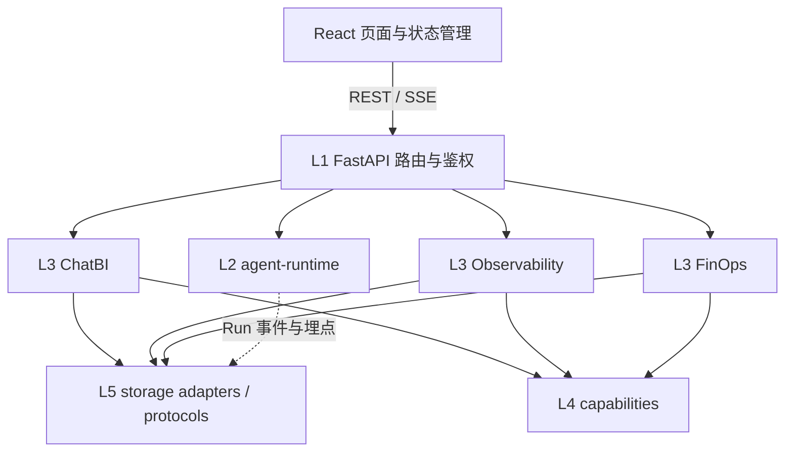

# dba-platform 代码优化说明

> 此前结构整理遵循 **零行为变化** 原则，主要做去重、抽取、简化与注释补全，并以 `ruff`、`mypy --strict` 和 `pytest` 校验。本轮（2026-10-02）保持五层架构与 API 契约，修复联调报告中的 P0/P1，并为核心状态转换和回退路径补充回归测试。

## 本轮优化：架构边界与 P0/P1 修复（2026-10-02）

### 架构与模块依赖

项目使用 Python `uv` workspace（Python ≥3.12）、FastAPI 与 React 18/TypeScript/Vite 7。现有五层依赖方向清晰：L1 API 负责鉴权、路由与装配；L2 `agent-runtime` 提供 Pipeline、RunContext 与埋点协议；L3 ChatBI、Observability、FinOps 持有各自领域流程；L4 capabilities 提供共享能力；L5 storage 适配 MySQL、Mongo、Redis、Milvus、Elasticsearch 和 MinIO。Ruff 的 `banned-api` 规则约束 L3 模块不能互相导入。

### 本轮改动

- **ChatBI 重试**：首轮与重试共用生成上下文构造，重试继续带 Schema、问题与可访问表约束，并附失败 SQL、错误码和反馈；降低模型在回退时臆造表名的概率。
- **SQL 函数校验**：对白名单仍严格拒绝未知函数，但对 SQLGlot AST 按 MySQL 方言还原函数名，避免 `DATE_FORMAT` / `DATE_SUB` 等合法函数因内部节点名被拒。
- **前端终态**：`run.finished` 按后端 `success`、`failed`、`timeout` 等值映射状态；终态清理重试提示、收束未结束步骤；查询输入贯穿 SSE 运行期禁用，收到终态或快照后恢复。
- **观测页面**：KPI 类型匹配 `{value, label?}` 响应；路由级错误边界捕获页面渲染异常，边界位于全局导航内部区域，避免页面异常卸载应用外壳。
- **Run 详情**：ChatBI 与 Observability 详情接口复用 `read_run_doc`，从 Mongo `run_doc` 仓储读取，缺失时维持 `{}` 回退并记录读取异常。
- **重复结构与说明**：将 10 个受保护页面的重复鉴权包装收敛为一个父路由；同步前端 README 和联调状态。未发现额外可安全删除的生产死代码，保留动态装配、占位和迁移入口。
- **回归覆盖**：新增后端 SQL 重试上下文、日期函数/未知函数、两个 Run 详情接口的回归用例；新增前端 Run 状态、输入禁用恢复、KPI 包装值和页面错误边界测试。

### 优化理由与整体影响

修复集中在已复现的接口与状态边界，不改变分层、数据库结构、API 路径或响应形状。共用生成上下文和 Run 文档读取入口可避免并行实现继续分叉；状态终结规则明确后，失败 Run 不会遗留重试 UI 或锁死输入；前端契约匹配后，观测 KPI 能渲染，单页异常也有局部恢复界面。新增测试依赖仅用于前端回归，不影响生产 bundle。

**本轮验证**：Ruff 全仓通过；mypy 检查 166 个源文件无错误；pytest 为 **173 passed / 29 skipped**；Vitest 为 **7 passed**；`npm run build` 成功。真实浏览器 e2e 本轮未重跑，本机 API 与前端端口当前未监听，且流程依赖外部存储服务。

---

## 此前结构整理记录：总体评估

### 架构与技术栈
项目是一个 **uv workspace 单体仓库**，采用 **五层架构（L1 接入层 → L5 存储层）**，由 Ruff 的 `banned-api` 规则强制约束 **L3 业务模块之间禁止互相 import**（红线 1）。三大业务模块职责边界清晰：

| 模块 | 职责 | 核心机制 |
|------|------|----------|
| **ChatBI** | 自然语言 → 数据大屏 | 七步流水线（intent→schema_link→sql_gen→sql_guard→sql_exec→visual→narrator）+ 五道 SQL 护栏 |
| **Observability** | 观测 Agent 舰队自身 | 四角色流水线（collect→aggregate→anomaly→broadcast）、EWMA+MAD 无阈值异常检测 |
| **FinOps** | 成本计量与预算治理 | 预算守卫三段式（reserve→settle/release）、复用率/成本曲线 |

**评估结论**：整体分层合理、职责单一、命名规范一致。主要问题集中在 **横切关注点的重复实现**（AST 解析、JSON 容错、DI 降级样板），而非结构性问题。本次优化即针对这些重复点收敛。

### 优化前后对比

| 指标 | 优化前 | 优化后 |
|------|--------|--------|
| AST 工具实现 | 2 份重复（readonly / row_scope） | 1 份共享（`guard/ast_utils.py`） |
| JSON 容错解析 | 6+ 处散落 try/except | 1 个共享模块（`util/jsonx.py`） |
| 预算状态迁移逻辑 | 2 段重复（settle / release） | 1 个 `_transition` 私有方法 |
| DI 存储装配 try/except | 6 段重复 | 1 个 `_load_component` 辅助 |
| 接口层降级样板 | 30+ 处 `is None` 判断 | 2 个辅助函数 |
| 死代码 | `is_hard_dependency` 等 | 已移除 |
| `ruff check` | clean | clean |
| `mypy --strict` | clean | clean（166 文件） |
| `pytest` | 165 passed | 165 passed, 29 skipped |

---

## 二、主要改动点

### 1. 新增 `guard/ast_utils.py` —— 统一 AST 工具（消除最严重的重复）

**问题**：`_tables_in` / `_alias_map` / `_column_usage` 三个 sqlglot AST 工具函数，在 `readonly.py` 和 `row_scope.py` 中各存在一份几乎相同的实现。任何一处修复（如 CTE 表名过滤的边界情况）都必须同步改两遍，极易遗漏。

**改动**：新建单一来源模块，提供五个纯函数：
- `cte_names(tree)` —— 提取 CTE 定义名
- `physical_tables(tree)` —— 物理表名（剔除 CTE 与别名）
- `alias_map(tree)` —— 别名 → 真实表名映射
- `column_usage(tree)` —— 列使用信息
- `parse_one_or_deny(sql, *, dialect, stage)` —— 统一解析入口，解析失败即抛出带 `stage` 标记的护栏错误（fail-closed）

**影响**：`readonly.py` 删除局部 `_tables_in`；`row_scope.py` 删除三个局部工具，改为 import（保留 `_parse_tree` 薄封装以兼容原有调用签名）；`dialect.py` / `limit_guard.py` 也改走统一解析入口。

> ⚠️ **关键坑**：`parse_one_or_deny` 的 `stage` 是 **keyword-only** 参数，不能直接把 `row_scope._parse_tree` 别名成它，否则调用方按位置传参会触发 `TypeError`（本次曾因此导致 25 个测试回归）。正确做法是保留 `_parse_tree(sql, stage)` 薄封装，内部以关键字参数调用。

### 2. 新增 `util/jsonx.py` —— 收敛 JSON 容错解析

**问题**：`try: json.loads(...) except JSONDecodeError: ...` 的"解析失败降级"模式散落在 6+ 处（LLM 输出解析、DB 字段反序列化、缓存读取等），每处降级策略还不完全一致。

**改动**：提供两个语义明确的函数：
- `loads_or[T](text, default)` —— 解析失败返回 `default`（PEP 695 泛型语法）
- `loads_object(text)` —— 专用于 LLM 输出：先整体解析，失败则提取最外层 `{...}` 子串再试，两级降级

**影响**：`sql_gen.parse_sql_payload`、`spec_builder._skill_panels` / `_parse_llm_panels`、`row_scope._values_of` / `_parse_join_path` 均改用共享函数，删除手写的围栏剥离与重复降级逻辑。

### 3. `repo.py` —— 合并预算状态迁移逻辑

**问题**：`BudgetReservationRepo.settle()` 与 `release()` 高度相似，都是「条件 UPDATE（仅当状态为 RESERVED）→ 读回行 → 拼装返回状态」。

**改动**：抽出私有方法 `_transition(reservation_id, *, state, extra)`，由 `settle` / `release` 各自调用，幂等状态机语义（RESERVED→SETTLED|RELEASED|EXPIRED）保持不变。

### 4. `di.py` —— 清理死代码与装配重复

- 删除 `is_hard_dependency()`（全项目仅定义、无任何调用）及其 `HARD_DEPENDENCIES` 导入。
- `build_storage_bundle` 中 6 处结构相同的「load → 失败则记警告并置 None」逻辑，抽取为 `_load_component(bundle, name, loader, *, assign)`。
- `_build_llm` 移除未被使用的 `container` 参数。

### 5. `api/v1/_common.py` —— 收敛接口层降级样板

**问题**：接口层（finops / observability 等）反复出现 `container.get("xxx") is None` 的降级判断，共 30+ 处，噪音大且易写错 key。

**改动**：新增 `service_or_default(container, key, default)` 与 `storage_or_default(container, default)`，批量替换后接口逻辑更聚焦于业务流程本身。

### 6. 核心逻辑中文注释补全

为以下关键位置补充了说明「用途 / 输入输出 / 注意事项」的中文 docstring：
- `capabilities/routing/gateway.py`：`route` / `_complete` / `_reserve` / `_settle` / `_release` / `_resolve_budget` / `_cost_of` / `_emit` 共 8 个方法
- `packages/agent-runtime/.../pipeline.py`：`Pipeline._run`（主循环顺序、失败分支、短路不重试语义）
- guard 层各 `check` 方法：明确校验顺序
- `repo.py._transition`、`sql_gen.parse_sql_payload`、`spec_builder` 相关方法

---

## 三、优化理由

1. **单一来源（Single Source of Truth）**：AST 工具与 JSON 容错是典型的横切逻辑，重复实现是缺陷的温床。收敛后修复只需一处。
2. **降低认知负荷**：接口层 30+ 处样板收敛为 2 个语义化函数后，阅读代码时不再被 `is None` 判断打断。
3. **命名与语义显式化**：`loads_or` / `loads_object` / `_transition` / `_load_component` 的名字直接表达意图，替代了原先「读代码才知道在干嘛」的裸逻辑。
4. **零行为变化**：所有改动都是等价重构，测试全绿证明语义未变——这是重构安全性的硬保证。

---

## 四、对项目整体的影响

- **可维护性 ↑**：横切逻辑集中后，后续修复/增强只需改动单点；新同学读代码时能一眼看清业务主干。
- **一致性 ↑**：护栏层统一走 `parse_one_or_deny`，解析失败的错误码与 `stage` 标记口径一致；接口层降级行为统一。
- **类型安全 ↑**：`mypy --strict` 在 166 个源文件上零错误，新增的泛型函数遵循 PEP 695 现代语法。
- **风险可控**：全程保持 165 passed / 29 skipped 的测试结果不变，未引入任何回归（曾短暂出现的 25 failed 已定位并修复）。
- **遗留项**：`ruff format` 在基线下就有 2 个文件不合规（`finops/sources.py`、`observability/service.py`），非本次引入，可按需单独处理。

---

*验证命令：`ruff check apps packages` · `mypy` · `pytest -q`*
